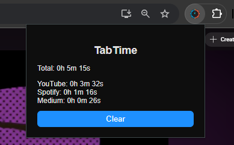

# TabTime (Extension)

A minimal extension that tracks how much time you spend on websites and shows it in a clean popup.

## Example

**Popup UI:**

##  Features

* Tracks time per website in real-time
* Auto-resets daily at midnight
* Manual reset button
* Simple live popup view

---

##  Installation

1. Open Chrome → `chrome://extensions`
2. Turn on **Developer mode**
3. Click **Load unpacked** and select the folder with `manifest.json`
4. Pin the extension to your toolbar

---

##  Usage

* Open the popup to see time spent per site
* Click **Reset** to clear data
* Data resets automatically each day

---

Made for simple, private productivity tracking.
